# Mac Mini M4 Pro · 本地 AI 全栈搭建教程

> **文字对话 + 图片生成 + 手机远程，全部跑在本地，完全私密、无审查、零 API 费用。**

**设备：** Mac Mini M4 Pro / 48GB 统一内存 ·  **更新：** 2026 年 6 月 5 日

---

## 一、为什么我选了 Mac Mini M4 Pro

我之所以选 Mac Mini M4 Pro 搞本地 AI，主要看中这几点：

**统一内存架构：**CPU 和 GPU 共享全部内存。我的 48GB 配置下，GPU
能直接访问约 38-40GB，可以跑 35B 甚至 70B 级别的量化模型。传统 PC
独显通常只有 8-24GB 显存，跑大模型捉襟见肘。

**功耗极低：**idle 大约 5-7W，满载推理也就 30-40W。我 7×24
小时开着当服务器，一年电费几乎可以忽略。

**体积和噪音：**巴掌大，塞在桌角完全不碍事，运行时几乎无声。

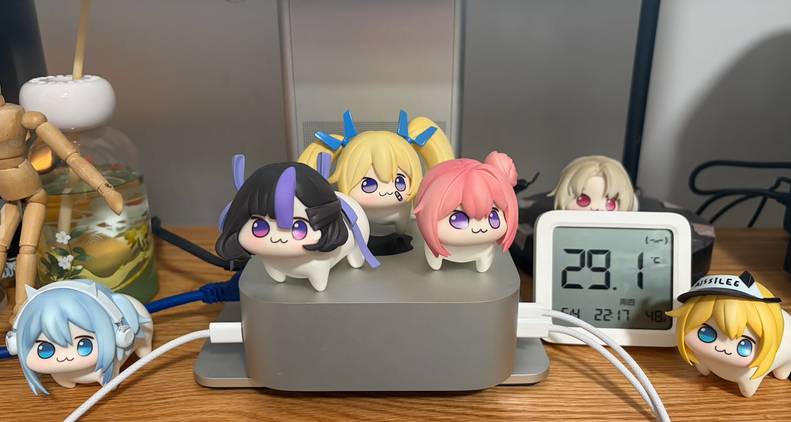

*小小的也挺可爱*

## 二、部署 LM Studio（文字大模型）

LM Studio 是一个有图形界面的本地 LLM
运行工具，不需要写代码，装好就能用。

### 2.1 安装

1. 打开 lmstudio.ai 下载 macOS Apple Silicon 版本

2. 把 .dmg 里的应用拖进 /Applications

3. 首次打开如果弹安全提示，去'系统设置 → 隐私与安全'允许运行

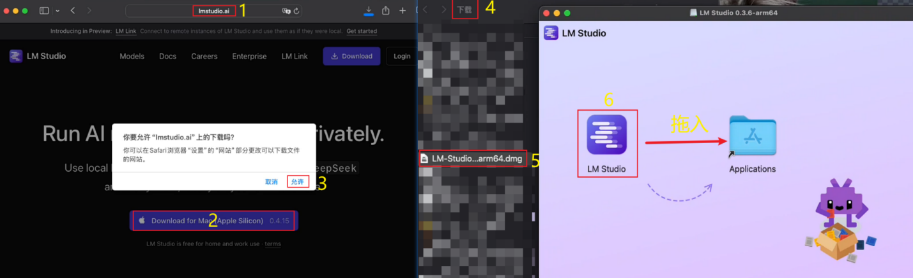

*下载可能需要使用魔法*

### 2.2 下载模型

打开 LM Studio，在搜索栏搜索模型名称，点击下载。

**主力模型：Qwen 3.6-35B-A3B**

> 搜索：Qwen3.6-35B-A3B  
> 选择：Q4_K_M（约 21GB）

MoE 架构，总参数 35B，但每次推理只激活
3B，速度快质量高。我实测日常聊天、写代码、分析文档都非常好用。

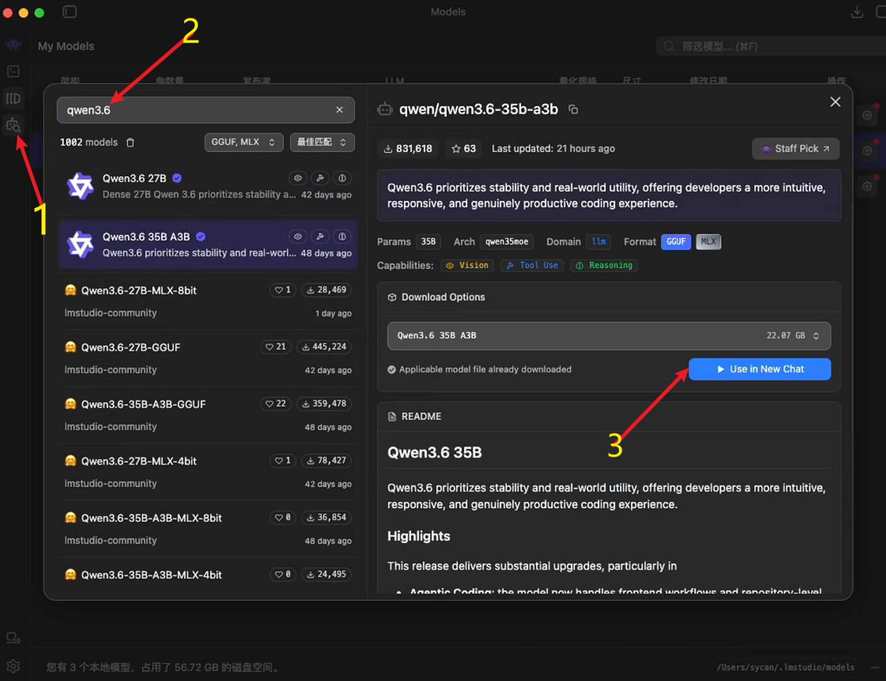

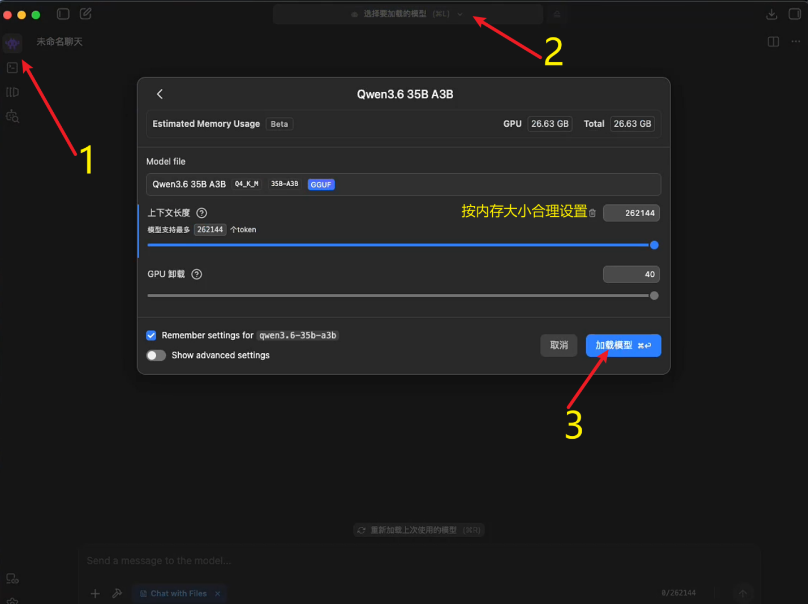

*加载模型*

**备选模型：Gemma 4-26B-A4B**

> 搜索：gemma-4-26B-A4B-it  
> 选择：Q4_K_M（约 16.8GB）

Google 出品，推理速度是 Qwen 的 3
倍左右。我主要在需要快速响应的场景用它。

**去限制版（按需）**

官方模型有内容审查，某些话题会拒绝回答。如果你需要完全无限制：

> 搜索：gemma-4-26B-A4B-it-ultra-uncensored-heretic  
> 选择：Q4_K_M

这是社区从权重层面移除了安全对齐的版本，不是改 prompt 那种表面绕过。

### 2.3 配置建议

加载模型后，我一般这样设：

| **参数**       | **值**    | **说明**                     |
|---|---|---|
| GPU Offload    | Max       | 统一内存下全放 GPU           |
| Context Length | Max       | 根据内存大小设置             |
| Temperature    | 0.7 / 0.1 | 聊天 0.7 自然；代码 0.1 精准 |

> [!TIP]
> 上下文越长内存占越多。8K 额外占 ~0.5GB，32K 约 4GB，128K 约 16GB。平时 8K 够用，需要时再调。

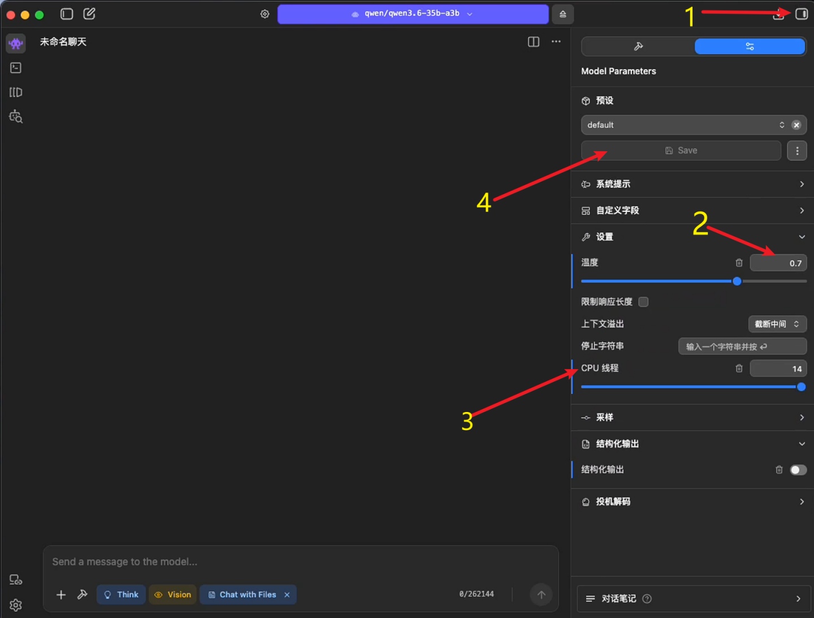

*参数调整*

### 2.4 开启 API 服务器

这步很关键，后面手机远程和桥接服务都依赖它：

1. 点 LM Studio 左侧 Developer（图标）

2. 确认模型已加载

3. 端口保持 1234

4. 开启相关服务

5. 复制本地访问地址

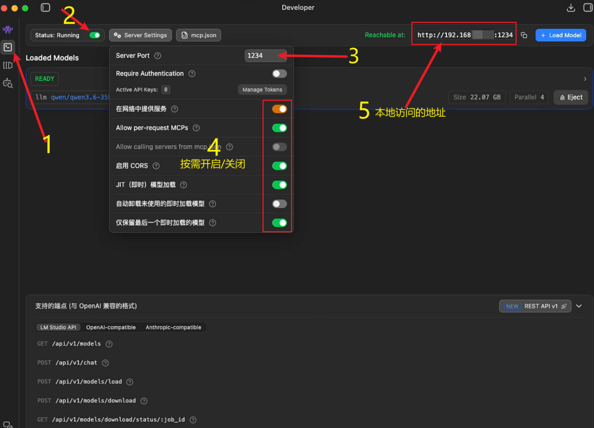

*开启 API 服务*

验证：

```bash
curl http://localhost:1234/v1/models
```

看到 JSON 模型列表就说明成功了。

> [!WARNING]
> Host 必须改成 0.0.0.0，否则其他设备无法访问。这是我踩的第一个坑。

## 三、部署 Draw Things（图片生成）

### 3.1 安装

App Store 搜索 Draw Things，免费下载。Apple 原生开发，内置 Metal
FlashAttention 加速。

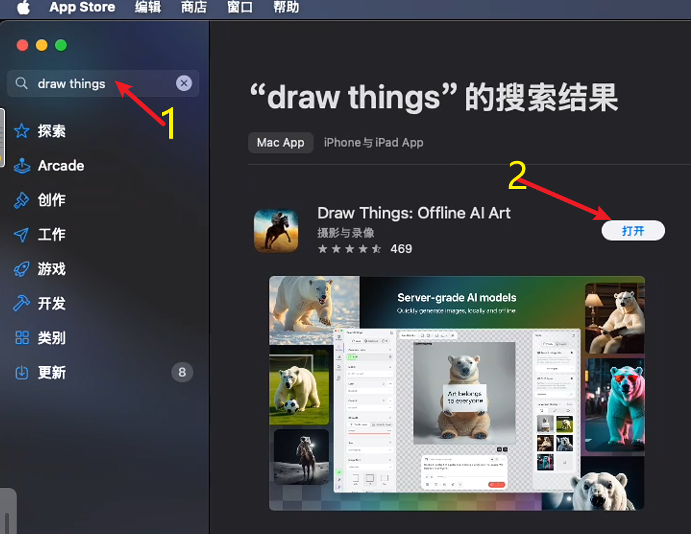

*下载 Draw Things*

### 3.2 下载模型

打开 Draw Things → 模型管理器 → 搜索 z image：

Z image Turbo1.0 (8-bit S)：蒸馏极速版，仅需 8 步即可出图（快速好用）

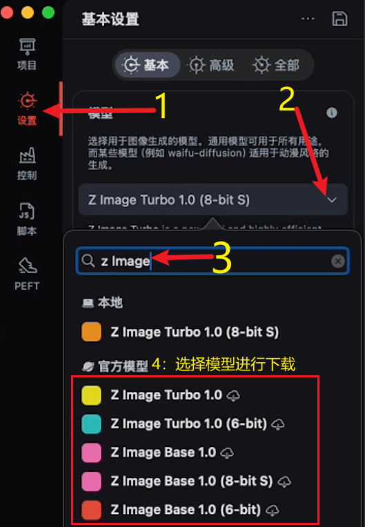

*搜索并下载模型*

> [!TIP]
> Z Image 生成速度很快，8 步出图，个人认为比豆包生成的要好。

### 3.3 开启 API 服务器

1. Draw Things → 设置（齿轮图标）

2. 点击高级

3. Server Online → 启用

4. 选择 HTTP

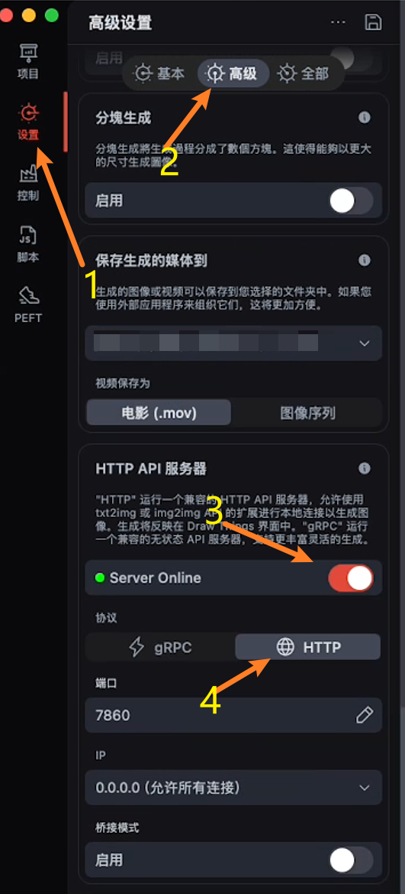

*开启 Draw Things API 服务器*

### 3.4 测试出图

终端执行：

```bash
curl -X POST http://localhost:7860/sdapi/v1/txt2img \
  -H "Content-Type: application/json" \
  -d '{"prompt":"Core scene of the image: A huge old tree stands in the center of the frame, lush with branches and leaves, with a bench under its shade. Character activities: A brown puppy sits on the bench playing a guitar. A white puppy blows bubbles on the grass. A white puppy runs while holding a pink heart-shaped balloon. A yellow puppy jumps and cheers on the grass. A little bear swims in the stream on the left. There is also a small white animal (possibly a rabbit or a puppy) resting on a tree branch. Environmental atmosphere: The surroundings are filled with blooming white and yellow daisies, butterflies fluttering, the stream babbling, the overall color tone is fresh and easy on the eyes, full of vitality and joy., high quality","width":1024,"height":1024,"steps":8,"guidance_scale":1,"guidance_embed":3.5,"seed":-1}'
```

> [!WARNING]
> 不同模型参数不同！涡轮模型用 guidance_scale:1 + guidance_embed:3.5 + steps:8；FLUX.2 Dev 用 guidance_scale:3.5（去掉 guidance_embed）+ steps:20。搞错参数模型不看 prompt，出来的图和描述对不上。

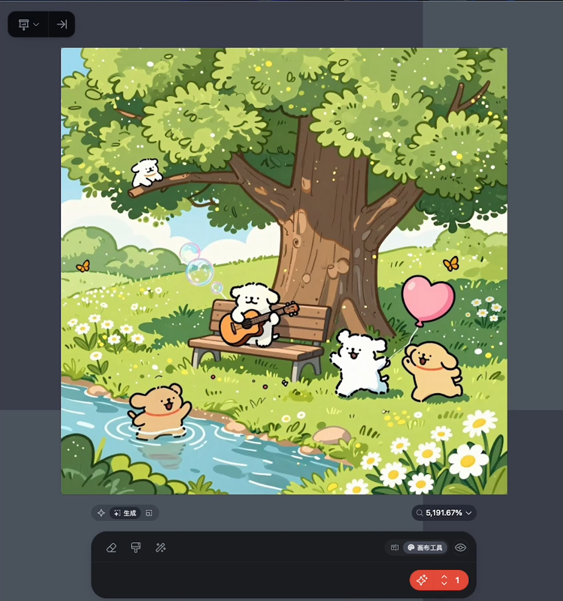

*生成的线条小狗*

## 四、远程访问：手机随时随地用

我一开始想直接用局域网 IP 连，结果踩了一堆坑——路由器 AP 隔离、VPN
冲突、有线无线混用。最后发现 Tailscale 最省事。

### 4.1 配置 Tailscale

**Mac Mini 端**

1. 访问 tailscale.com 注册（可以用 Google/GitHub 账号）

2. 下载安装 Mac 客户端

3. 登录后获取虚拟 IP：

```bash
tailscale ip -4
# 比如：100.124.216.99
```

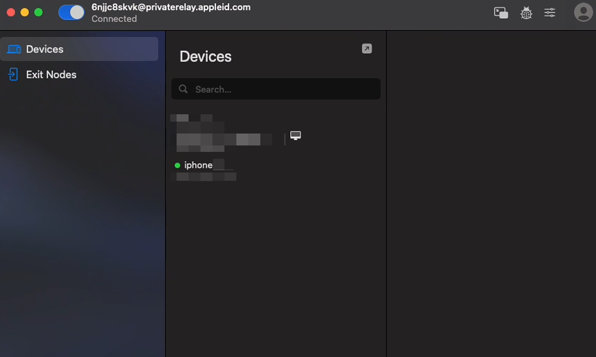

*Mac 和 iPhone 可互相访问*

**手机端**

1. App Store / Google Play 搜 Tailscale 下载

2. 同一账号登录

3. 手机浏览器访问 http://100.x.x.x:1234/v1/models

看到 JSON 就说明通了。不管在家还是外面用 5G，都能连回 Mac
Mini。免费版支持 100 台设备，全程加密。

## 五、桥接服务：对话中直接生成图片

这是整个系统最有趣的部分——一个 Python 脚本把 LM Studio 和 Draw Things
串起来，聊天中说「画一只猫」就自动出图。

### 5.1 工作原理

桥接服务提供标准 OpenAI 兼容
API，判断用户消息中是否包含「画」、「生成」等关键词：

- 包含关键词 → 提取描述 → 翻译成英文 → 调用 Draw Things 生成图片 →
返回图片链接

- 不包含 → 原样转发 LM Studio → 返回文字回复

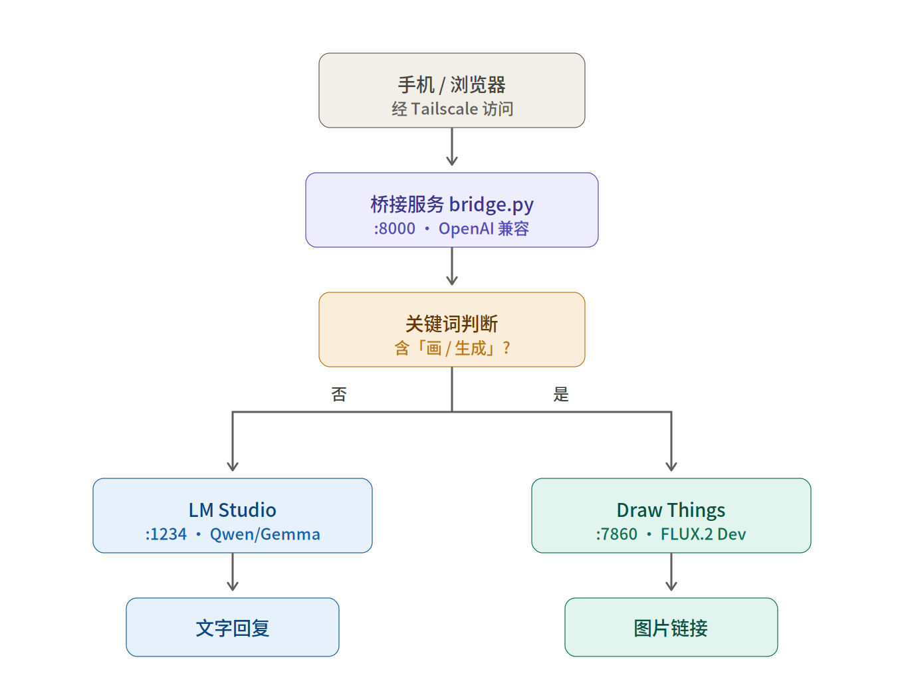

*工作流*

> [!TIP]
> 提示词会自动将用户发送的中文提示词转换成英文提示词。

### 5.2 部署

将 bridge.py 保存到任意目录（我放在 ~/Downloads），确保 LM Studio 和
Draw Things 都已启动并开启 API，然后：

```bash
cd ~/Downloads
python3 bridge.py
```

桥接服务启动在 8000 端口。

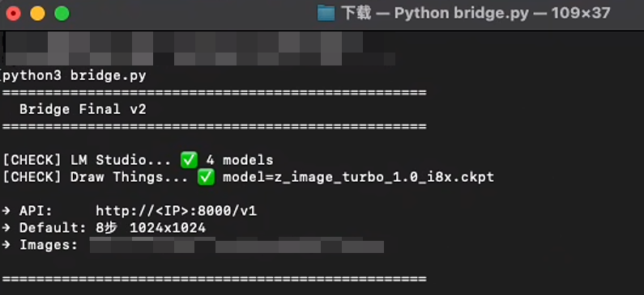

*启动服务*

### 5.3 使用方式

| **发送内容**               | **行为**                    |
|---|---|
| 普通消息                   | 转发 LM Studio，正常对话    |
| 含「画/生成/draw」         | 自动翻译 + Draw Things 出图 |
| 「画一只猫 步数30」        | 自定义步数（更精细但更慢）  |
| 「画一只猫 宽1920 高1080」 | 自定义尺寸                  |

生成的图片保存在 ~/Pictures/ai-generated/ 目录。

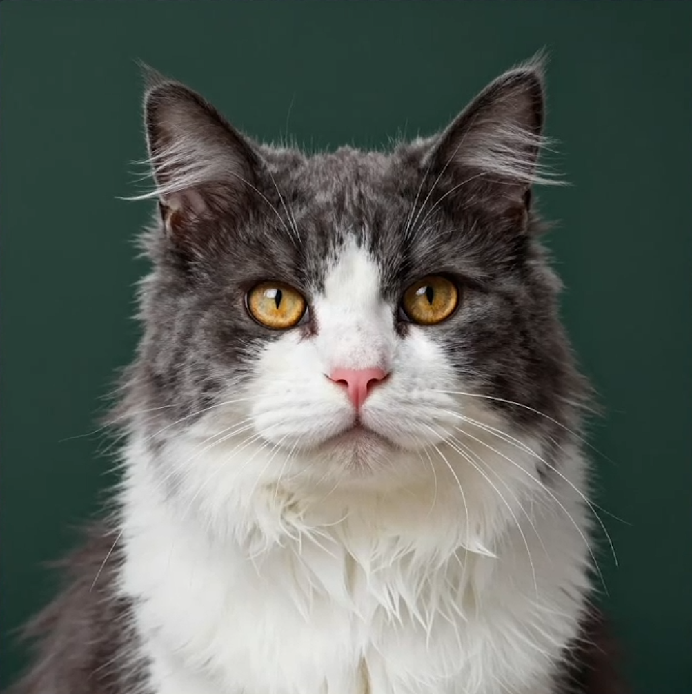

*生成的小猫咪*

## 六、网页聊天界面

我写了一个网页聊天界面，把 chat.html 和 bridge.py
放在同一目录，桥接服务会自动提供网页。

### 6.1 访问

手机或电脑浏览器打开：

`http://100.x.x.x:8000/`

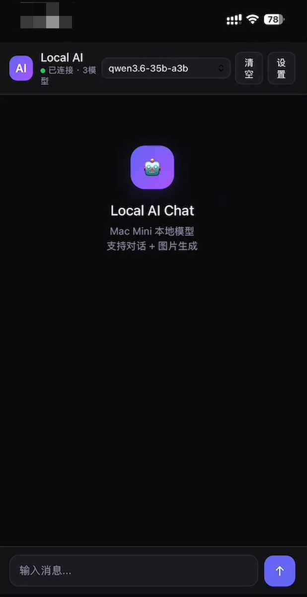

*手机访问页面*

### 6.2 功能

- 连续对话：完整对话历史，AI 记得上下文

- 持久化：关了浏览器再打开，记录还在

- 多会话：左侧栏新建、切换、删除对话

- 图片显示：生成的图片直接显示在对话气泡里

- 模型切换：右上角选择已加载的模型

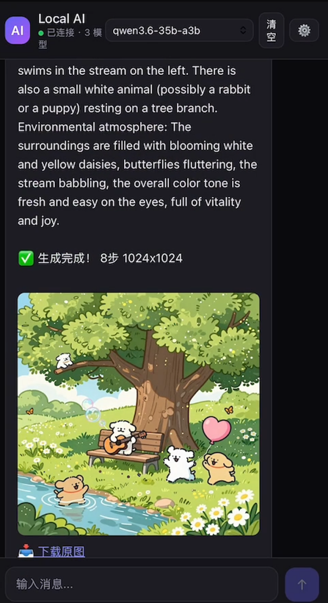

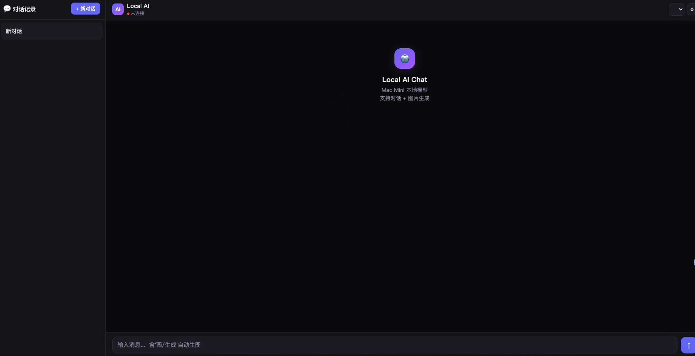

*交互页面*

## 七、手机 App 客户端

如果更喜欢用原生 App：

### 7.1 OpenCat（iOS）

App Store 搜索 OpenCat，设置：

- API 模式：OpenAI 兼容

- 基础 URL：http://100.x.x.x:8000/v1

- 密钥：不用填

- 模型：点击浏览后自动加载

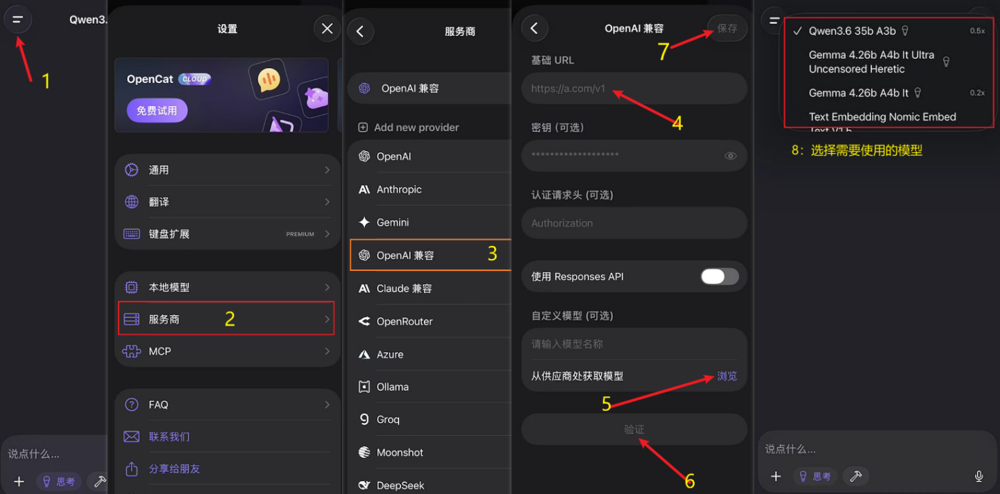

*手机客户端使用指南*

## 八、Mac Mini 服务器化

我是 7×24 小时开着的，以下设置保证稳定运行：

### 8.1 防止休眠

```bash
sudo pmset -a sleep 0 displaysleep 0 disksleep 0
```

### 8.2 关闭锁屏密码

'系统设置 → 锁定屏幕 → 需要密码的时间'→ 永不（根据个人使用习惯设置）

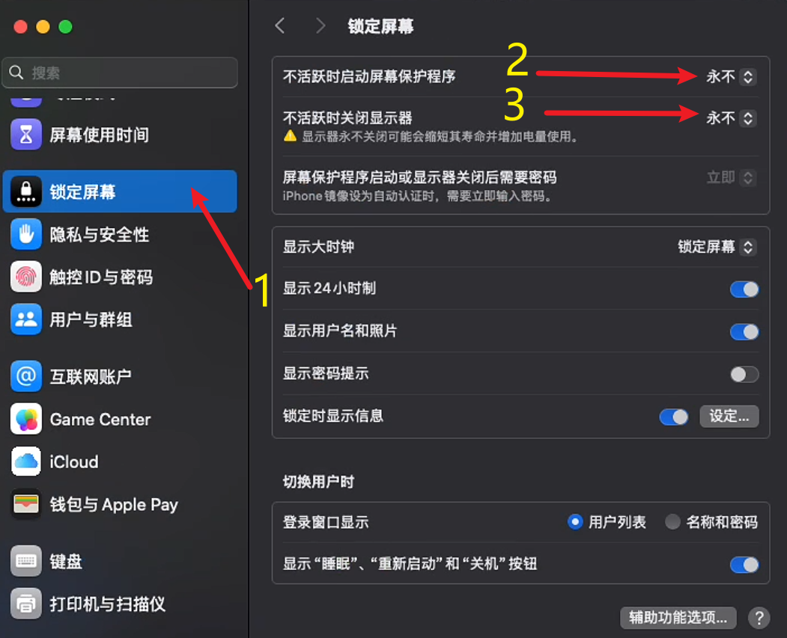

*防止屏幕自动关闭设置（根据个人使用习惯设置）*

> [!NOTE]
> 像我这样「关闭锁屏密码」时，这一项是灰色的、改不了，该如何解决？

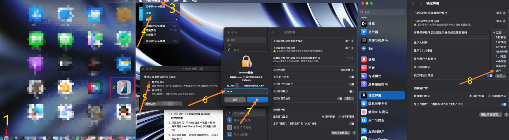

*详细的操作步骤（根据个人使用习惯设置）*

### 8.3 开启远程管理

'系统设置 → 通用 → 共享'：

- 屏幕共享 → 开（VNC 远程桌面）

- 远程登录 → 开（SSH）

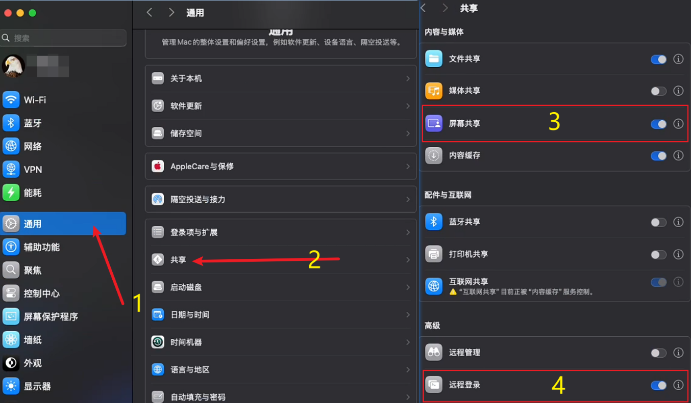

*开启远程管理（根据个人使用习惯设置）*

### 8.4 无显示器运行

Mac Mini 没接显示器时可能降低分辨率导致远程画面异常。买个 HDMI
欺骗器（淘宝十几块），插上就正常了。

## 九、踩坑记录与排查

这些都是我实际踩过的坑，分享出来供大家参考。

### 9.1 其他常见问题

| **问题**           | **解决方案**                                            |
|---|---|
| 端口被占用         | lsof -i :8000 查看；避免用 5000（AirPlay 占用）         |
| App 一直思考没响应 | 桥接用流式输出保持连接；检查 Draw Things 是否加载了模型 |
| 网页显示未连接     | 点 ⚙（设置图标）确认 API 地址正确；确认桥接在运行       |

## 十、模型推荐与横评

### 10.1 文字模型（48GB 可跑）

我的搭配：Qwen 3.6-35B-A3B 日常主力 + Gemma 4 需要快速响应时切换。

### 10.2 图片模型

我的搭配：FLUX.2 Dev Exact + Z image。

### 10.3 下载链接

所有模型在 LM Studio 中搜索即可下载，也可以从 HuggingFace 手动下载 GGUF
文件：

- Qwen 3.6-35B-A3B：https://huggingface.co/lmstudio-community/Qwen3.6-35B-A3B-GGUF

- Gemma 4-26B-A4B：https://huggingface.co/lmstudio-community/gemma-4-26B-A4B-it-GGUF

- Gemma 4 去限制版：https://huggingface.co/mradermacher/gemma-4-26B-A4B-it-ultra-uncensored-heretic-GGUF

- Llama 4 Scout：https://huggingface.co/lmstudio-community/Llama-4-Scout-17B-16E-Instruct-GGUF

- Devstral Small：https://huggingface.co/lmstudio-community/Devstral-Small-2507-GGUF

> [!TIP]
> 所有模型选 Q4_K_M 量化版本即可，是质量和大小的最佳平衡点。

## 写在最后

整套系统全部运行在本地，所有数据不出你的设备，完全私密。

从安装到能在手机上聊天生图，我大概花了两天时间，中间踩了不少坑，但最终效果非常满意——随时随地打开手机就能用自己的
AI，不限制、不审查、不花 API 费用。

希望这篇教程对你有帮助。如果有问题欢迎交流！

2026 年 6 月 5 日 晚 1:58
